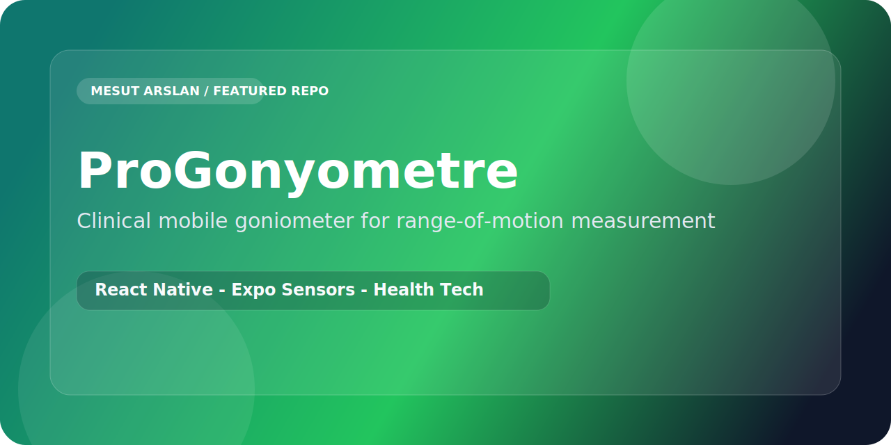

<p align="center">
  
</p>

<p align="center">
  
  
  
</p>

# ProGonyometre

ProGonyometre turns a common physiotherapy need into a focused mobile product: measure joint range of motion quickly, clearly, and with tools already in your pocket.

## Why This Project Matters

- Brings ROM measurement into a mobile-first workflow
- Reduces friction during repeated assessment sessions
- Fits real clinic usage better than generic utility apps
- Positions physiotherapy practice inside a modern digital toolset

## Core Highlights

- Smartphone sensor based measurement flow
- Fast session-oriented mobile interface
- Clinical use case around assessment and follow-up
- Lightweight stack that is easy to iterate on

## Stack

- React Native
- Expo
- Expo Sensors
- React Navigation

## Product Direction

The goal is not just to build a measurement screen. The goal is to create a practical health-tech tool that feels fast enough for real appointments and clear enough for repeat clinical use.

## Run Locally

```bash
npm install
npx expo start
```
